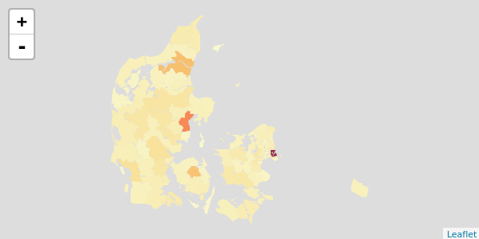
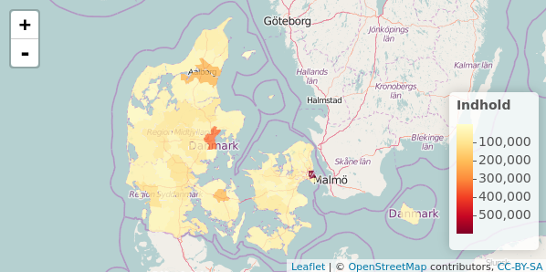
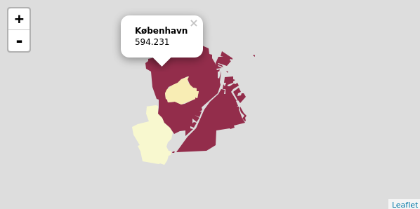
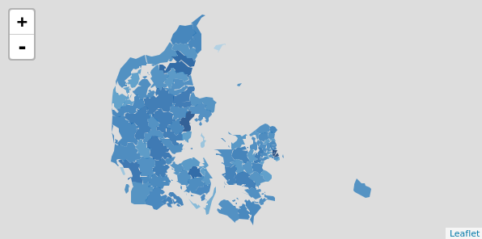

<!-- README.md is generated from README.Rmd. Please edit that file -->
What is this?
-------------

[a center for ants!?](https://youtu.be/7ffj8SHrbk0)

leafletDK is a package that makes it easy to create interactive dynamic leaflet maps based on danish administrative areas.

The package is heavily inspired by the amazing [mapDK](https://github.com/sebastianbarfort/mapDK) package by [Sebastian Barfort](https://twitter.com/sbarfort), which I recommend if you want to create static high quality maps.

Also a special thanks to [Kenneth Rose](https://twitter.com/kennethrose82) for fixing encoding issues on Windows! (I wrote the original package on Linux, where shit just work).

Getting started
---------------

First you need to install the package from github. You do this by running:

    devtools::install_github("56north/leafletDK") # install devtools if needed

After install it is really easy to use leafletDK. Simply call the administrative area that you want to map (like a municipality) and give it the data you want the map to be colored by.

Below is an example where we load data from Statistics Denmark and map it using leaflet.

First we load the package and get the most recent population count for Denmark via the API from Statistics Denmark.

    library(leafletDK)

    folk1 <- read.csv2("http://api.statbank.dk/v1/data/folk1/CSV?OMR%C3%85DE=*",
                       stringsAsFactors = FALSE, encoding = "UTF-8")

Now we have a data frame with three columns. "OMRÅDE" is the area, "TID" is time/date and "INDHOLD" is the people count. We will use the "OMRÅDE" and "INDHOLD" columns to call the municipalityDK function.

    municipalityDK("INDHOLD", "OMRÅDE", data = folk1)

As default leafletDK plots the map without an underlying map. You can turn this on by supplying the parameter `map = T`. You can also turn on the legend with `legend = T`.

    municipalityDK("INDHOLD", "OMRÅDE", data = folk1, map = T, legend = T)

This generates a map of Denmark where the 98 municipalities are colores according to the amount of people that live in each on. It becomes immediately apparent that a lot of people are living in Copenhagen municipality... a lot of people!

We can also zoom in the map on only a few select municipalities by selecting them with the subplot parameter. Lets take a look at Copenhagen (København), Frederiksberg and Hvidovre municipalities:

    municipalityDK("INDHOLD", "OMRÅDE", 
                    subplot = c("københavn", "frederiksberg", "hvidovre"), 
                    data = folk1)

This generates a map with only our three chosen municipalities. If you click on one of the areas, a little popup appears with the mapped values.

Getting ids
-----------

If you are in doubt of what ids are being used to generate the maps, then you can use the `getIDs` function to see a list. If we want to get a list of the municipalities we will do the following:

    getIDs("municipal")

The getIDs function accepts the following areas: "constituency", "district", "municipal", "parish", "regional", "rural" or "zip".

Changing the underlying map
---------------------------

You can change the underlying map by using the `addProviderTiles()` from the leaflet package. You can pipe the mapped areas directly to the function like this:

    municipalityDK("INDHOLD", "OMRÅDE", 
                    subplot = c("københavn", "frederiksberg", "hvidovre"), 
                    data = folk1) %>% 
                    addProviderTiles("Stamen.Toner")

You can get a full overview of the available maps (called tiles) on the [leaflet-providers preview page](http://leaflet-extras.github.io/leaflet-providers/preview/)
